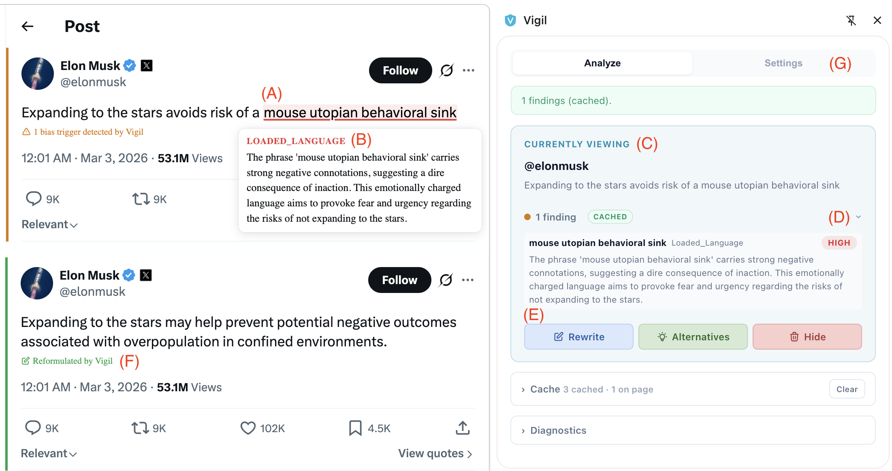
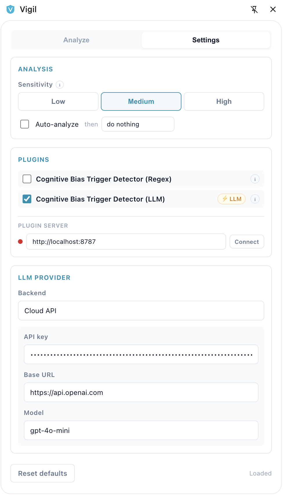

# Vigil — Real-Time Cognitive Bias Trigger Detection for Your Browser

Vigil is a Chrome extension that flags rhetorical patterns likely to trigger cognitive biases while you read web content. It suggests neutral rewrites and alternatives, helping you slow down and process information more rationally.

[Demo video](https://aida.ugent.be/videos/vigil-v001-demo.mp4)

## what Vigil does

- Detects cognitive bias triggers in page text (SemEval-style 14-technique taxonomy)
- Highlights flagged spans inline
- Shows findings in a sidepanel with explanations and severity
- Offers actions per item: rewrite, alternatives, or hide
- Supports multiple analysis paths:
  - fast local regex plugin (no LLM needed)
  - optional LLM plugin in-browser (WebLLM), local API (Ollama), or cloud API
  - optional backend plugin server (`FastAPI`) for additional analyzers (for example: moralization detection)

## who this is for

- Readers who want support processing information more rationally
- Researchers evaluating rhetoric and persuasion patterns
- Developers building bias-aware analysis plugins

## quick start (end users)

**annotated UI guide (A-G)**

This example shows Vigil running on a real social post, from detection to mitigation.



Use the labels below to map each part of the UI quickly.

- `A` highlighted phrase in the page text that was flagged as a cognitive bias trigger
- `B` inline explanation card with trigger label and rationale
- `C` sidepanel "Currently Viewing" block synced with the visible content
- `D` findings summary row with count, label, and severity chip
- `E` mitigation actions (`Rewrite`, `Alternatives`, `Hide`)
- `F` reformulated output marker shown after rewrite is applied
- `G` settings tab entry point for sensitivity, plugin, and model/backend configuration

**settings panel quick guide**

<p align="center">
  
</p>

- **analysis**: set sensitivity (`Low`, `Medium`, `High`) and optional auto-action (`do nothing`, `rewrite`, `show alternatives`, `hide content`)
- **plugins**: choose which detectors run in the browser (regex, LLM, or both)
- **plugin server**: connect to `http://localhost:8787` (or your custom URL) to enable server-side analyzers
- **llm provider**: choose backend (`Local API`, `Cloud API`, `Browser AI`) and set model/API fields
- **reset defaults**: restore all settings to the default profile

### requirements

- Chrome 118 or newer
- Node.js 18+ (for local build)
- Optional:
  - WebGPU-capable browser/GPU for WebLLM mode
  - local Ollama for local API mode
  - cloud API key for cloud mode

### install the extension from source

```bash
cd frontend
npm install
npm run build
```

Then in Chrome:

1. Open `chrome://extensions`
2. Enable **Developer mode**
3. Click **Load unpacked**
4. Select `frontend/dist`
5. Pin `Vigil` and open the sidepanel from the extension action

### optional backend plugin server

If you want server-side analyzers (for example `moralization-llm`):

```bash
cd backend
uv sync
uv run python app.py
```

Default server URL in the extension is `http://localhost:8787`.

### best practices for end users

- Treat results as prompts, not verdicts. A highlight means "look closer," not "this is false."
- Start with medium sensitivity. Move to high only when you need maximum recall and can tolerate more false positives.
- Prefer regex mode for quick scanning. Use LLM mode when you need richer explanations and reformulation.
- Verify important claims separately. Vigil checks rhetorical risk, not factual correctness.
- Keep auto-actions conservative. `do nothing` or `show alternatives` is usually safer than auto-hide.
- Export cache before sharing examples. Remove personal or sensitive text from exported JSON.
- Use cloud mode carefully. If you paste private content, assume it may be sent to your provider.

### privacy and safety notes

- Extension settings are saved in `chrome.storage.sync`.
- If you use cloud mode, API keys are stored in extension settings and synced by Chrome.
- If you use local API mode (for example Ollama), inference stays on your own machine.
- If you use backend plugins, text is sent to the configured server URL.

If you handle sensitive data, use local-only paths (regex + local API/WebLLM), and avoid cloud providers.

## contributor quick start

### repository layout

- `frontend/` — Chrome extension (TypeScript + Vite)
- `backend/` — optional plugin server (FastAPI + LiteLLM)

### local development

Frontend watch build:

```bash
cd frontend
npm install
npm run dev
```

Backend dev server:

```bash
cd backend
uv sync
uv run python app.py
```

### checks before opening a PR

```bash
cd frontend
npm run type-check
```

```bash
cd backend
uv run pytest
```

Also:

- manually test on at least one long-form article and one X/Twitter thread
- confirm no secrets are committed (`.env`, API keys, credentials)

### best practices for open-source contributors

- Keep plugin boundaries clean. Put frontend analyzers in `frontend/src/plugins` and server analyzers in `backend/plugins`.
- Keep defaults safe. New features should work without requiring cloud credentials.
- Prefer explainable outputs. Include spans, labels, severity, and concise rationale in findings.
- Make tradeoffs explicit in PRs. Note precision/recall impact and latency impact for detector changes.
- Add evaluation evidence for model/prompt updates. Include key metrics in the PR description.
- Keep UX predictable. Avoid auto-destructive actions and keep user control in the sidepanel.
- Document config changes. If you add env vars or settings, update this README and any relevant module README.

### adding new plugins

#### frontend browser plugin

1. Implement `BrowserPlugin` in `frontend/src/plugins`
2. Register in `frontend/src/plugins/registry.ts`
3. Add settings/UX wiring if needed

#### backend analyzer plugin

1. Implement `AnalyzerPlugin` in `backend/plugins`
2. Register via `@PluginRegistry.register_analyzer`
3. Ensure it surfaces through `/plugins` and supports `/analyze` (and `/reformulate` if applicable)

## troubleshooting

- Sidepanel cannot connect to backend:
  - check backend is running on `http://localhost:8787`
  - click `Settings -> Plugin Server -> Connect`
- WebLLM model fails to load:
  - verify Chrome/WebGPU support
  - try the smaller `qwen` model first
- No highlights appear:
  - confirm at least one browser plugin is enabled
  - check sensitivity level
  - inspect `Diagnostics` in the sidepanel

## project status

Active research/development project. APIs, plugin contracts, and UX may evolve quickly.

If you are planning production use, pin a release and validate behavior against your own dataset.

## acknowledgements

Funded by the European Union (ERC, VIGILIA, 101142229) and the Flanders AI Research program (FAIR). Views and opinions expressed are those of the authors only and do not necessarily reflect those of the EU or the ERCEA.

## license

This project is licensed under the [MIT License](LICENSE).

## citation

If you use Vigil in your research, please cite:

```bibtex
@misc{kang2026vigil,
  title         = {Vigil: An Extensible System for Real-Time Detection and Mitigation of Cognitive Bias Triggers},
  author        = {Kang, Bo and Noels, Sander and De Bie, Tijl},
  year          = {2026},
  eprint        = {2604.03261},
  archivePrefix = {arXiv},
  primaryClass  = {cs.CL}
}
```

See [`CITATION.cff`](CITATION.cff) for machine-readable metadata.
